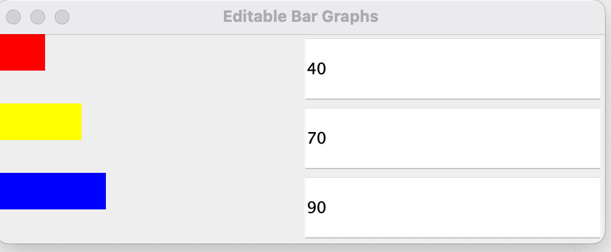

# BarGraph.java
The main driver where the frame is created and GraphView is invoked
## Objects:
- model: instance of the ModelNumber class, passed as a parameter to Graphview
- frame: instance of the JFrame class imported from the swing package

# GraphView.java
Graphview is a child class of the awt package JPanel file, and implements ModelNumber.java `ModelObserver` interface. This program creates the graph view, and observes for changes.

## construct GraphView
*paramter:* model referencing ModelNumber
- the instance of what we are observing (the model number)
sets the model as an `observer` object invoking `addObserver(this)`
and sets the view layout as the model size  with two columns
then calls `initializeComponents()`.

## Methods:
`initalizeComponents()`
invokes `removeall()` an inherited awt Container method to remove all the components from the view 
Then for each value input in the model, we render a new bar by invoking `BarComponent()` which is a nested child class.
Also rendering a new text field with the input value attatched, and a new listener to the text fields by invoking ~~`addKeyListener()`~~ `addActionListener()` an inherited event ActionListener interface method. 
The call `revalidate()` and `repaint()` to revalidate and repaint the component.

`update()` is overriden here by invoking `innitializeComponents()` to repaint the view

## nested class
`BarComponent` extends `JComponent`, this class represents the individual bar of the graph.

### Method:
`paintComponent()`, a JComponent method
*parameter:* g referencing Graphics object
overriden to set the color of the bar bsed on the its index, and the width of the bar is set by the model input value. 

# TextFieldController.java
~~Text field event controller, extending the java event `KeyAdapter` class.~~ This class is responsible for the keyboard event response.

## variables
`index`, bar graph value
`model`, ModelNumber reference 
`textField`, JTextField swing subclass reference

## Method
~~`keyReleased()`, keyboard event method inherited from the KeyEvent class~~
~~paramter: `event` of type `Keyevent` referencing the KeyEvent class~~
*logic:* try to get the text in the `textField` and pass this value to `parseInt()` to convert as an integer then store this value in `newValue`. Then passes this `newValue` to `setValue()` at the specified index.
If the text cannot be parsed to an integer, an exception is thrown to reset the test field to the current value already stored in `model`.
- this caused the text feild to only take in one value at a time, like if i wanted to type `50` it will only pass `5`.

so instead of updating every time a key is released, we can use `ActionsListener()` to update when we press enter.
*paramter:* `e` of type `ActionEvent` referencing the ActionEvent interface
*logic:* does not change, only diffrenece are the parameters passed.

# ModelNumber.java
public parent class 

## construct 
`ModelNumber()`
Holds the input `values` and the `observers` that listen for input changes

## interface 
`ModelObserver()`
holds the `update()` method that is invoked by the `notifyObservers()` method

## Methods:
`addObserver()` 
*parameter:* observer of type ModelObserver 
- references the observers array list object 
*logic:* adds an `observer` to the `observers` array list

`getSize()`
*logic:* returns the `values` array list size by invoking `size()`

`getValue()`
*logic:* returns the `values` array list element at a specified `index` by invoking get()

`addValue()`, adds a new value
*parameters:* integer `value`, given by the user
*logic:* adds a value element to the `values` array list and invokes `notifyObservers()`

`setValue()`, updates an existing value
*parameters:* two integers
- `index`, actual index of the values array list 
- `value`, input given by user
*logic:* checks if the input value is between 0-100, set the `value` element to the `values` array at a specified `index` and invoke the `notifyObservers()`

`notifyObservers()`, notify changes to the observer
*logic:* for each `observer` element in the `observers` array list, invoke `update()` to the referenced `observer` object.

# Compile and run
direct to the base file `cd .../Homework4`

In terminal:
to compile `javac BarGraph.java GraphView.java ModelNumber.java TextFieldController.java`
to run `java BarGraph.java GraphView.java ModelNumber.java TextFieldController.java`

Picture of the popup window when running:

video: 
<video controls src="SourceLauncher - Editable Bar Graphs - 22 May 2025.mp4" title="Editable Bar Graph Input video"></video>